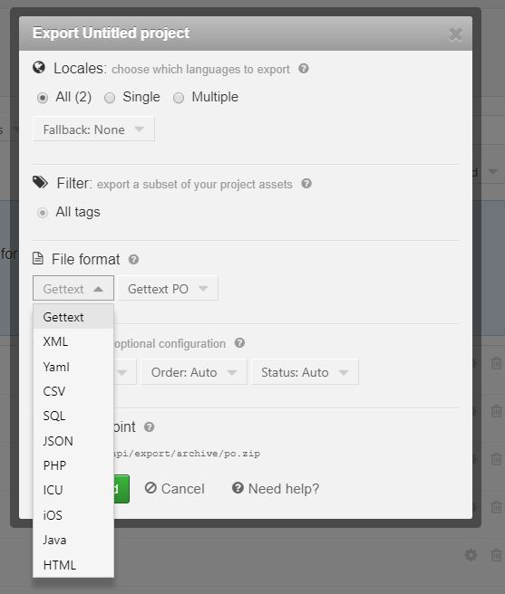
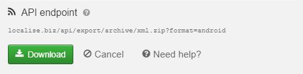
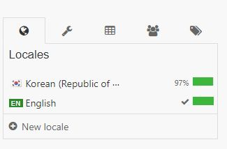
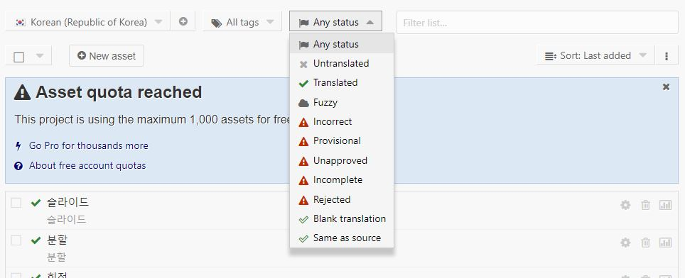

안녕하세요 Reno 입니다.

이번에는 제가 업무를 통해서 알게된 LOCO라는 툴에 대해서 공유를 해볼까 합니다.

이전에는 번역 문구를 구글 스프레드 시트로 관리하고 있었는데 바꾸길 잘했다는 생각이 들어서

LOCO의 장단점 및 사용 후기를 공유해보려고합니다. :)

# 1. LOCO란?

LOCO란 번역관리툴입니다.

번역 요청하고 번역하고 적용하는 일련의 과정을 LOCO라는 툴을 통해 한번에 관리할 수 있습니다.

만약 글로벌 서비스를 하고 계시다면 다양한 언어들을 번역하는 과정을 거치시게 되실텐데요

지원하는 언어가 많으면 많을 수록 관리하기 쉽지가 않습니다.

현재 얼마나 진행되고 있는지 엑셀로 쉽게 파악이 되지 않죠.

번역 관리를 좀 더 편하고 쉽게 하고 싶은 분들에게 추천해드립니다.

[LOCO 홈페이지](https://localise.biz/about)

# 2. 장점?

- 장점 1 : 플랫폼이 지원하는 스트링 파일 포맷에 맞게 바꿔줍니다.

  

  JSON부터 Android, IOS에 맞는 스트링 포맷을 지원하기 때문에 엑셀 사용시 문구를 복붙하거나 파일을 컨버팅해주는 과정이 필요없습니다.
개발자에겐 너무 편하죠 ㅎㅎ

- 장점 2 : API를 지원합니다.

  

  loco는 api를 지원하기 때문에 간단한 쉘스크립트를 통해 (api를 지원하기 때문에 다른 방법도 가능하겠죠??) 자동으로 string 파일을 다운받고 적용하는 일이 가능합니다 ㅎㅎ

- 장점 3 : 번역 진행도 확인이 편합니다.

  

  loco는 현재 번역이 어느정도 진행되었는지 보기 쉽게 보여줍니다.

- 장점 4 : 문구 찾기가 쉽습니다.

  

  loco는 진행 상태별, 태그별, 언어별로 카테고리를 나눠서 보여줍니다.

# 3. 단점?
 - 단점 1 : 새로운 툴에 대한 학습이 필요합니다.

  새로운 툴을 학습하는데 어려움을 많이 겪는 구성원이라면 사용하기 어려울것 같습니다.
  하지만 배우고자 하는 의지가 있다면 쉽게 배울수 있습니다.

 - 단점 2 : 중국어 export시 번체만 export 해줍니다.

 저희 서비스는 중국어 번체와 간체를 모두 지원을 하는데 API를 통해 모든 문구를 export할때 번체만 export 시켜줍니다.
 이 부분은 좀 치명적이긴하지만 간체만 다시 export하는 방식으로 해결을 했습니다. loco 담당자에게 컨택해서 해결되는지 여부를 물어보고 있는 상태네용 .. 답변이 오면 다시 공유하겠습니다.

 - 단점 3 : 자동 번역을 지원하지 않습니다.

  치명적인 단점은 아니지만 단점이라면 단점이라 할 수 있겠습니다. 홈페이지에는 아직 지원을 안하고 있다는 걸 보면 언젠간 지원을 할 수도 있겠다는 생각이 드네요??

# 3. 사용 후기

확실히 반복적이고 단순한 일일수록 자동화하는 일은 중요한것 같습니다. LOCO를 통해 개발자는 개발에 좀 더 집중하고, 매니저는 좀 더 편하고 확실하게 번역 진행 상황을 관리할 수 있지 않나라는 생각이 듭니다. 만약 글로벌 서비스를 하고 계시거나 하실 예정이라면 이 툴을 사용해보시는 것을 추천해드립니다. :)

추가적으로 사용하면서 새롭게 알게된 정보들이 있으면 추가글로 공유하도록 하겠습니다~
안뇽~